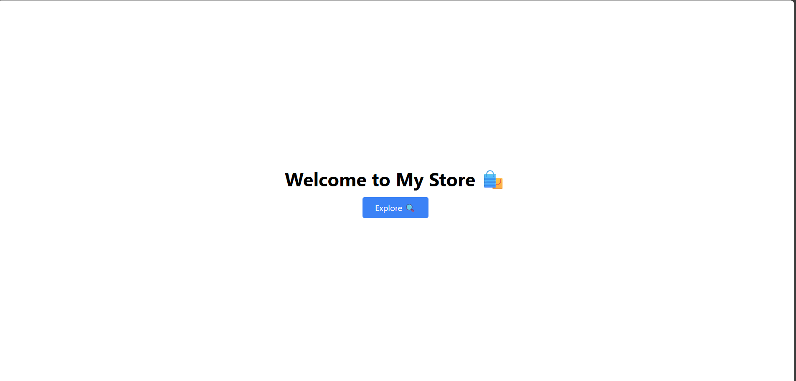
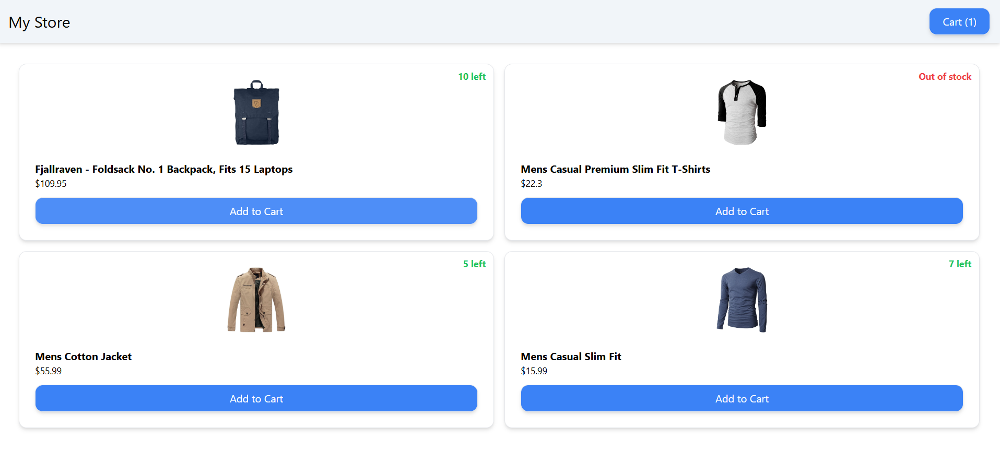
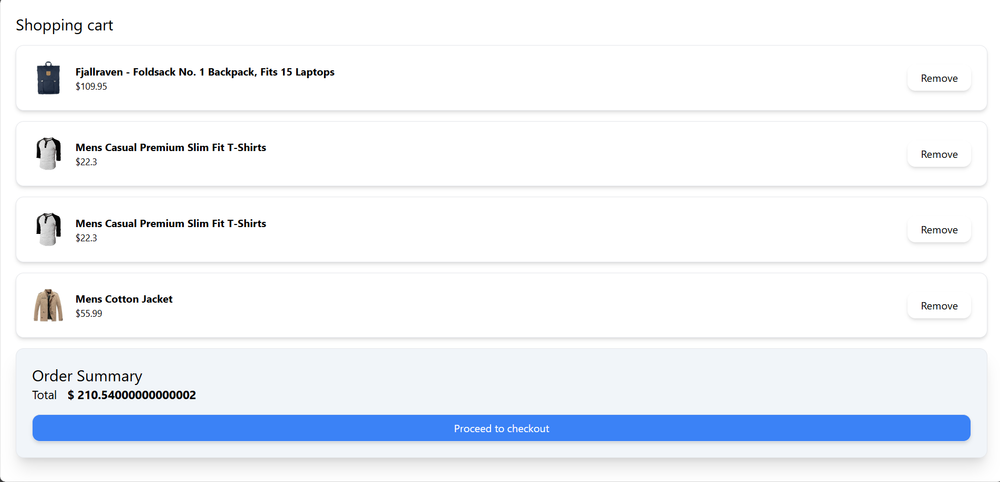

# 🛒 Angular E-commerce Storefront

A modern, responsive single-page e-commerce application built using Angular, Tailwind CSS, and RxJS Signals. Users can browse products, manage a cart, and navigate smoothly across views using Angular routing.

---

## 🚀 Features

- 🧱 **Component-Based Architecture**: Clean modular design using reusable components like buttons, headers, etc.
- 🛍️ **Product Listing**: Displays products with title, price, image, and live stock counter.
- 🛒 **Cart Management**: Add or remove items from the cart with real-time updates via Angular Signals.
- 📦 **Stock Tracking**: Dynamically updates available stock; disables cart actions when stock is zero.
- 🌐 **Routing**: Smooth navigation between the product listing and cart pages.
- 🎨 **Tailwind CSS**: Clean, responsive UI styled using Tailwind utility classes.

---

## 🧰 Tech Stack

- **Frontend Framework**: Angular
- **Language**: TypeScript
- **Styling**: Tailwind CSS
- **Routing**: Angular Router
- **State Management**: RxJS Signals (Reactive Cart)

---

## 📦 Installation

```bash
# Clone the repository
git clone https://github.com/Petlavenkatamanoj/ecommerceprojectStore
cd angular-ecommerce

# Install dependencies
npm install

# Start the development server
ng serve

```
## 🖼️ Project Demo

This section shows how the application looks and behaves in real time. The UI is clean, responsive, and easy to use, making shopping a seamless experience.

Welcome Page  


Product Listing Page  


Cart Page  


Each view is fully devloped, with dynamic updates powered by RxJS Signals. Users can browse products, see live stock, and manage their cart efficiently.s
